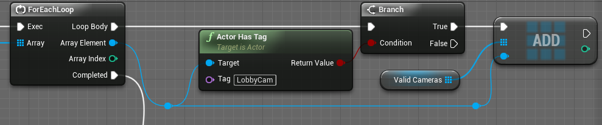
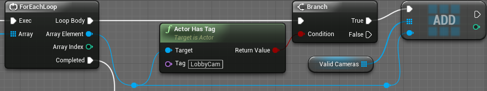
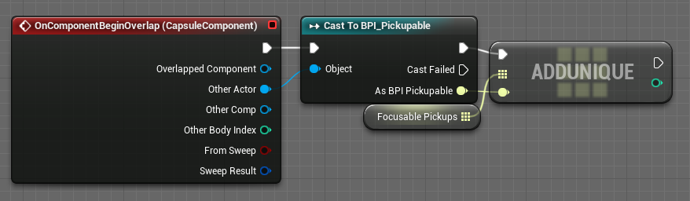

# 🦞 Руководство по стилю для разработчиков на Unreal Engine (Naming Conventions)

Данное руководство является переводом: [ссылка на оригинал](https://github.com/Allar/ue5-style-guide)

Однако, данный перевод имеет некоторые [отличия](#отличия-от-оригинала) от оригинала.

## Оглавление

* [Важная терминология](#важная-терминология)
  * [Уровни/карты](#уровникарты)
  * [Идентификаторы](#идентификаторы)
  * [Варианты написания идентификаторов](#варианты-написания-идентификаторов)
  * [Переменные/Свойства](#переменныесвойства)
    * [Свойство](#свойство)
    * [Переменная](#переменная)
* [0. Принципы](#0-принципы)
  * [0.1 Если в вашем проекте уже есть руководство по стилю, вы должны следовать ему](#01-если-в-вашем-проекте-уже-есть-руководство-по-стилю-вы-должны-следовать-ему)
  * [0.2 Вся структура, ассеты и код в любом проекте должны выглядеть так, как будто их создал один человек, независимо от того, сколько людей внесли свой вклад](#02-вся-структура-ассеты-и-код-в-любом-проекте-должны-выглядеть-так-как-будто-их-создал-один-человек-независимо-от-того-сколько-людей-внесли-свой-вклад)
  * [0.3 Друзья не позволяют своим друзьям иметь плохой стиль](#03-друзья-не-позволяют-своим-друзьям-иметь-плохой-стиль)
  * [0.4 Команда без руководства по стилю — не моя команда](#04-команда-без-руководства-по-стилю--не-моя-команда)
  * [0.5 Не нарушайте закон](#05-не-нарушайте-закон)
* [00. Общепринятые правила](#00-общепринятые-правила)
  * [00.1 Запрещённые символы](#001-запрещённые-символы)
    * [Идентификаторы](#запрещённые-символы-в-идентификаторах)
* [1. Соглашения об именовании ассетов](#1-соглашения-об-именовании-ассетов)
  * [1.1 Базовое имя ассета - `Prefix_BaseAssetName_Variant_Suffix`](#11-базовое-имя-ассета---prefix_baseassetname_variant_suffix)
    * [1.1 Примеры](#11-примеры)
  * [1.2 Модификаторы имени ассета](#12-модификаторы-имени-ассета)
    * [1.2.1 Наиболее популярные](#121-наиболее-популярные)
    * [1.2.2 Анимации](#122-анимации)
    * [1.2.3 Искусственный интеллект](#123-искусственный-интеллект)
    * [1.2.4 Blueprints](#124-blueprints)
    * [1.2.5 Материалы](#125-материалы)
    * [1.2.6 Текстуры](#126-текстуры)
      * [1.2.6.1 Упакованные текстуры](#1261-упакованные-текстуры)
    * [1.2.7 Разное](#127-разное)
    * [1.2.8 Paper 2D](#128-paper-2d)
    * [1.2.9 Физика](#129-физика)
    * [1.2.10 Звуки](#1210-звуки)
    * [1.2.11 Пользовательский интерфейс](#1211-пользовательский-интерфейс)
    * [1.2.12 Эффекты](#1212-эффекты)
* [2. Структура каталога Content](#2-структура-каталога-content)
  * [2e1 Пример структуры каталога Content](#2e1-пример-структуры-каталога-content)
  * [2.1 Имена папок](#21-имена-папок)
    * [2.1.1 Всегда используйте PascalCase](#211-всегда-используйте-pascalcase)
    * [2.1.2 Никогда не используйте пробелы](#212-никогда-не-используйте-пробелы)
    * [2.1.3 Никогда не используйте символы Unicode и другие символы](#213-никогда-не-используйте-символы-unicode-и-другие-символы)
  * [2.2 Используйте папку верхнего уровня для проекта](#22-используйте-папку-верхнего-уровня-для-проекта)
    * [2.2.1 Нет глобальных ассетов](#221-нет-глобальных-ассетов)
    * [2.2.2 Уменьшение конфликтов при миграции](#222-уменьшение-конфликтов-при-миграции)
      * [2.2.2e1 Пример мастер-материала](#222e1-пример-мастер-материала)
    * [2.2.3 Образцы, шаблоны и контент из Marketplace не создают риска внедрения](#223-образцы-шаблоны-и-контент-из-marketplace-не-создают-риска-внедрения)
    * [2.2.4 DLC, подпроекты и патчи легко поддерживать](#224-dlc-подпроекты-и-патчи-легко-поддерживать)
  * [2.3 Используйте папку Developers для локального тестирования](#23-используйте-папку-developers-для-локального-тестирования)
  * [2.4 Все файлы Map лежат в папке с названием Maps](#24-все-файлы-map-лежат-в-папке-с-названием-maps)
  * [2.5 Используйте папку Core для важных Blueprints и других ассетов](#25-используйте-папку-core-для-важных-blueprints-и-других-ассетов)
  * [2.6 Не создавайте папки с именами `Assets` или `AssetTypes`](#26-не-создавайте-папки-с-именами-assets-или-assettypes)
    * [2.6.1 Создание папки с именем `Assets` является излишним](#261-создание-папки-с-именем-assets-является-излишним)
    * [2.6.2 Создание папки с именем `Meshes`, `Textures` или `Materials` является избыточным](#262-создание-папки-с-именем-meshes-textures-или-materials-является-избыточным)
  * [2.7 Очень большие наборы ассетов получают собственную папку](#27-очень-большие-наборы-ассетов-получают-собственную-папку)
  * [2.8 `MaterialLibrary`](#28-materiallibrary)
  * [2.9 Никаких пустых папок](#29-никаких-пустых-папок)
* [3. Blueprints](#3-blueprints)
  * [3.1 Компиляция](#31-компиляция)
  * [3.2 Переменные](#32-переменные)
    * [3.2.1 Именование](#321-именование)
      * [3.2.1.1 Существительные](#3211-существительные)
      * [3.2.1.2 PascalCase](#3212-pascalcase)
        * [3.2.1.2e Примеры](#3212e-примеры)
      * [3.2.1.3 Префикс `b` для boolean](#3213-префикс-b-для-boolean)
      * [3.2.1.4 Имена для boolean](#3214-имена-для-boolean)
        * [3.2.1.4.1 Общая и независимая информация о состоянии](#32141-общая-и-независимая-информация-о-состоянии)
        * [3.2.1.4.2 Комплексные состояния](#32142-комплексные-состояния)
      * [3.2.1.5 Учитывайте контекст](#3215-учитывайте-контекст)
        * [3.2.1.5e Примеры](#3215e-примеры)
      * [3.2.1.6 Не включайте имена атомарных типов](#3216-не-включайте-имена-атомарных-типов)
      * [3.2.1.7 Включайте имена неатомарных типов](#3217-включайте-имена-неатомарных-типов)
      * [3.2.1.8 Массивы](#3218-массивы)
    * [3.2.2 Редактируемые переменные](#322-редактируемые-переменные)
      * [3.2.2.1 Подсказки](#3221-подсказки)
      * [3.2.2.2 Слайдер и диапазоны значений](#3222-слайдер-и-диапазоны-значений)
    * [3.2.3 Категории](#323-категории)
    * [3.2.4 Уровень доступа к переменным](#324-уровень-доступа-к-переменным)
      * [3.2.4.1 Закрытые переменные](#3241-закрытые-переменные)
    * [3.2.5 Дополнительные переменные](#325-дополнительные-переменные)
    * [3.2.6 Transient-переменные](#326-transient-переменные)
    * [3.2.7 Config-переменные](#327-config-переменные)
  * [3.3 Функции, события и диспетчеры событий](#33-функции-события-и-диспетчеры-событий)
    * [3.3.1 Именование функций](#331-именование-функций)
	  * [3.3.1.1 Все имена функций должны быть глаголами](#3311-все-имена-функций-должны-быть-глаголами)
      * [3.3.1.2 Свойство RepNotify всегда OnRep\_Variable](#3312-свойство-repnotify-всегда-onrep_variable)
      * [3.3.1.3 Информационные функции, возвращающие bool, должны задавать вопросы](#3313-информационные-функции-возвращающие-bool-должны-задавать-вопросы)
      * [3.3.1.4 Обработчики событий и диспетчеры должны начинаться с On](#3314-обработчики-событий-и-диспетчеры-должны-начинаться-с-on)
      * [3.3.1.5 Удаленные вызовы процедур должны начинаться с префикса Target](#3315-удаленные-вызовы-процедур-должны-начинаться-с-префикса-target)
    * [3.3.2 Все функции должны иметь Return Nodes](#332-все-функции-должны-иметь-return-nodes)
    * [3.3.3 Ни одна функция не должна иметь более 50 узлов](#333-ни-одна-функция-не-должна-иметь-более-50-узлов)
    * [3.3.4 Все публичные (public) функции должны иметь описание](#334-все-публичные-public-функции-должны-иметь-описание)
    * [3.3.5 Все пользовательские статические BlueprintCallable функции подключаемых модулей должны быть классифицированы по имени подключаемого модуля](#335-все-пользовательские-статические-blueprintcallable-функции-подключаемых-модулей-должны-быть-классифицированы-по-имени-подключаемого-модуля)
  * [3.4 Blueprint Graphs](#34-blueprint-graphs)
    * [3.4.1 Никакого спагетти-кода](#341-никакого-спагетти-кода)
    * [3.4.2 Выравнивание линий, а не узлов](#342-выравнивание-проводов-а-не-узлов)
    * [3.4.3 Белые линии Exec имеют наивысший приоритет](#343-белые-линии-exec-имеют-наивысший-приоритет)
    * [3.4.4 Код должен быть разумно прокомментирован](#344-код-должен-быть-разумно-прокомментирован)
    * [3.4.5 Код должен обрабатывать ошибки Cast, где это уместно](#345-код-должен-обрабатывать-ошибки-cast-где-это-уместно)
    * [3.4.6 В коде не должно быть висящих/свободных/мёртвых узлов](#346-в-коде-не-должно-быть-висящихсвободныхмёртвых-узлов)
* [4. Static Meshes](#4-static-meshes)
  * [4.1 Static Mesh UV](#41-static-mesh-uv)
    * [4.1.1 Все Static Meshes должны иметь UV](#411-все-static-meshes-должны-иметь-uv)
    * [4.1.2 Все Static Meshes не должны иметь перекрывающихся UV для карт освещения](#412-все-static-meshes-не-должны-иметь-перекрывающихся-uv-для-карт-освещения)
  * [4.2 LOD должны быть настроены правильно](#42-lod-должны-быть-настроены-правильно)
  * [4.3 Модульные ассеты без сокетов должны четко привязываться к Static Mesh](#43-модульные-ассеты-без-сокетов-должны-четко-привязываться-к-static-mesh)
  * [4.4 Все Static Meshes должны иметь коллизию](#44-все-static-meshes-должны-иметь-коллизию)
  * [4.5 Все Static Meshes должны быть правильно масштабированы](#45-все-static-meshes-должны-быть-правильно-масштабированы)
* [5. Niagara](#5-niagara)
  * [5.1 Без пробелов, всегда](#51-без-пробелов-всегда)
* [6. Уровни/карты](#6-уровникарты)
  * [6.1 Отсутствие ошибок или предупреждений](#61-отсутствие-ошибок-или-предупреждений)
  * [6.2 Освещение должно быть рассчитано](#62-освещение-должно-быть-рассчитано)
  * [6.3 Игрок не должен видеть пересекающиеся текстуры (Z Fighting)](#63-игрок-не-должен-видеть-пересекающиеся-текстуры-z-fighting)
  * [6.4 Особые правила Marketplace](#64-особые-правила-marketplace)
    * [6.4.1 Overview уровень](#641-overview-уровень)
    * [6.4.2 Demo уровень](#642-demo-уровень)
* [7. Текстуры](#7-текстуры)
  * [7.1 Размеры должны быть степенью двойки](#71-размеры-должны-быть-степенью-двойки)
  * [7.2 Плотность текстур должна быть одинаковой](#72-плотность-текстур-должна-быть-одинаковой)
  * [7.3 Текстуры должны быть не больше 8192](#73-текстуры-не-должны-быть-больше-8192-пикселей)
  * [7.4 У текстур должна быть выбрана правильная группа](#74-у-текстур-должна-быть-выбрана-правильная-группа)

## Важная терминология

### Уровни/карты

Слово «карта» обычно относится к тому, что обычный человек называет «уровнем», и может использоваться взаимозаменяемо. Смотрите историю этого термина [здесь](https://en.wikipedia.org/wiki/Level\_\(video\_gaming\)).

### Идентификаторы

Идентификатор - это всё, что напоминает или служит «именем». Например, имя ассета, имя материала, свойство blueprint, переменная, имя папки, имя строки таблицы и т. д.

### Варианты написания идентификаторов

Есть несколько разных способов написания идентификаторов. Вот некоторые распространенные варианты:

> **PascalCase**
>
> Используйте каждое слово с заглавной буквы и удалите все пробелы, например `DesertEagle`, `StyleGuide`, `ASeriesOfWords`.
>
> camelCase
>
> Первая буква всегда строчная, но каждое последующее слово начинается с прописной, например `desertEagle`, `styleGuide`, `aSeriesOfWords`.
>
> **Snake\_case**
>
> Слова могут произвольно начинаться с верхнего или нижнего регистра, но слова разделяются символом подчеркивания, например `desert_Eagle`, `Style_Guide`, `a_Series_of_Words`.

### Переменные/Свойства

Слова «переменная» и «свойство» в большинстве контекстов взаимозаменяемы. Но если они оба используются вместе в одном и том же контексте, то:

### Свойство

Обычно относится к переменной, определенной в классе. Например, если у `BP_Barrel` есть переменная `bExploded`, то `bExploded` можно назвать свойством `BP_Barrel`.

### Переменная

Обычно это либо аргумент функции, либо просто локальная переменная внутри функции.

## 0. Принципы

Эти принципы были адаптированы из [руководства по стилю idomatic.js](https://github.com/rwaldron/idiomatic.js/).

### 0.1 Если в вашем проекте уже есть руководство по стилю, вы должны следовать ему

Если вы работаете над проектом или с командой, в которой уже есть руководство по стилю, его следует придерживаться. При любом несоответствии между существующим руководством по стилю и стилем в вашей команде предпочтение должно отдаваться стилю вашей команды.

> **«Споры о стиле бессмысленны. Должно быть руководство по стилю, и вы должны ему следовать».**
>
> [_Ребекка Мерфи_](https://rmurphey.com/)

### 0.2 Вся структура, ассеты и код в любом проекте должны выглядеть так, как будто их создал один человек, независимо от того, сколько людей внесли свой вклад

Переход от одного проекта к другому не должен вызывать повторного изучения стиля и структуры. Соответствие руководству по стилю устраняет ненужные догадки и двусмысленности.

Это также позволяет более продуктивно создавать и поддерживать проект, поскольку не нужно думать о стиле. Просто следуйте инструкциям. Это руководство по стилю написано с учётом лучших практик, а это означает, что, следуя этому руководству по стилю, вы также сведёте к минимуму проблемы, которые трудно отследить.

### 0.3 Друзья не позволяют своим друзьям иметь плохой стиль

Если вы видите, что кто-то работает либо против руководства по стилю, либо вообще без такового, постарайтесь это исправить.

При работе в команде или при обсуждении в сообществе, таком как [Unreal Slackers](http://join.unrealslackers.org/), гораздо проще помогать и просить о помощи, когда люди последовательны. Никому не нравится распутывать чьи-то спагетти в Blueprint или иметь дело с ассетами, названия которых они не могут понять.

Если вы помогаете кому-то, чья работа соответствует другому, но последовательному и разумному руководству по стилю, вы должны быть в состоянии адаптироваться к нему. Если они не соответствуют какому-либо руководству по стилю, отправьте их сюда.

### 0.4 Команда без руководства по стилю — не моя команда

Когда вы присоединяетесь к команде Unreal-разработчиков, одним из ваших первых вопросов должен быть: «Есть ли у вас руководство по стилю?». Если ответ отрицательный, вы должны скептически относиться к их способности работать в команде.

### 0.5 Не нарушайте закон

Gamemakin LLC не является юристом, но, пожалуйста, не привносите в проект незаконные действия и поведение, включая, помимо прочего:

* Не распространяйте контент, на распространение которого у вас нет прав
* Не нарушайте чьи-либо авторские права или товарные знаки
* Не воруйте контент
* Соблюдайте лицензионные ограничения контента

## 00. Общепринятые правила

### 00.1 Запрещённые символы

### Запрещённые символы в идентификаторах

Ни в каком идентификаторе **никогда не** используйте следующие символы, кроме случаев крайней необходимости:

* Пробельный символ любого типа
* Обратная косая черта`\`
* Символы, такие как `#!@$%`
* Любой Unicode-символ

Любой идентификатор должен стремиться иметь только следующие символы, когда это возможно (RegEx `[A-Za-z0-9_]+`)

* ABCDEFGHIJKLMNOPQRSTUVWXYZ
* abcdefghijklmnopqrstuvwxyz
* 1234567890
* \_

Соблюдение этих правил обеспечит наибольшую совместимость всех данных на всех платформах во всех инструментах и ​​поможет предотвратить простои из-за потенциально неправильной обработки символов идентификаторов в коде, который вы не контролируете.

## 1. Соглашения об именовании ассетов

Соглашения об именовании ассетов следует рассматривать как закон. В проекте, где поддерживается это соглашение, очень легко управлять ассетами, искать, анализировать и поддерживать их.

Большинство ассетов имеют префикс, который обычно представляет собой аббревиатуру типа ассета, за которой следует символ подчеркивания.

### 1.1 Базовое имя ассета - `Prefix_BaseAssetName_Variant_Suffix`

Все ассеты должны иметь _базовое имя ассета_. Базовое имя _ассета_ представляет собой логическую группу связанных ассетов. Любой _ассет_, входящий в эту логическую группу, должен соответствовать стандарту: `Prefix_BaseAssetName_Variant_Suffix`.

Помнить шаблон `Prefix_BaseAssetName_Variant_Suffix` и руководствоваться здравым смыслом, как правило, достаточно, чтобы гарантировать хорошее имя _ассета_. Вот несколько подробных правил относительно каждого элемента.

`Prefix` и `Suffix` должны определяться типом ассета с помощью таблиц [модификаторов имени ассета](#12-модификаторы-имени-ассета).

`BaseAssetName` должно определяться коротким и легко узнаваемым именем, относящимся к контексту данной группы ассетов. Например, если у вас есть персонаж по имени Боб, все ассеты Боба будут иметь `BaseAssetName` - `Bob`.

Для уникальных и специфических вариантов ассетов используется `Variant`. `Variant` - это короткое и легко узнаваемое имя, представляющее логическую группу ассетов, являющихся подмножеством базового имени ассета. Например, если у Боба есть несколько скинов, эти скины все равно должны использовать `Bob` как `BaseAssetName`. Но при этом скин «Evil» будет называться `Bob_Evil`, а скин «Ретро» будет называться `Bob_Retro`.

Для уникальных, но универсальных вариантов ассетов `Variant` - это двузначное число, начинающееся с `01`. Например, если у вас есть художник по окружающей среде, создающий невзрачные камни, они будут называться `Rock_01`, `Rock_02`, `Rock_03` и т. д. За редчайшим исключением, у вас никогда не должен быть трехзначный номер варианта. Если у вас более 100 ассетов, вам следует рассмотреть возможность организации их с разными базовыми именами или с использованием нескольких вариантов имён.

В зависимости от того, как создаются варианты ваших ассетов, вы можете связать вместе имена вариантов. Например, если вы создаете элементы напольного покрытия для проекта Arch Viz, вы должны использовать базовое имя `Flooring` со связанными вариантами, такими как `Flooring_Marble_01`, `Flooring_Maple_01`, `Flooring_Tile_Squares_01`.

### 1.1 Примеры

### 1.1e1 Боб

| Тип ассета               | Имя ассета      |
| ------------------------ | --------------- |
| Skeletal Mesh            | SK\_Bob         |
| Material                 | М\_Bob          |
| Texture (Diffuse/Albedo) | T\_Bob\_D       |
| Texture (Normal)         | T\_Bob\_N       |
| Texture (Evil Diffuse)   | T\_Bob\_Evil\_D |

### 1.1e2 Камни

| Тип ассета               | Имя ассета     |
| ------------------------ | -------------- |
| Static Mesh (01)         | S\_Rock\_01    |
| Static Mesh (02)         | S\_Rock\_02    |
| Static Mesh (03)         | S\_Rock\_03    |
| Material                 | M\_Rock        |
| Material Instance (Снег) | MI\_Rock\_Snow |

### 1.2 Модификаторы имени ассета

При именовании ассета используйте эти таблицы для определения префикса и суффикса, которые следует использовать с [базовым именем ассета](#11-базовое-имя-ассета---prefix_baseassetname_variant_suffix).

### 1.2.1 Наиболее популярные

<table><thead><tr><th>Тип ассета</th><th width="103">Prefix</th><th width="136">Suffix</th><th>Примечание</th></tr></thead><tbody><tr><td>Level / Map</td><td></td><td></td><td><a href="#24-все-файлы-map-лежат-в-папке-с-названием-maps">Должны находиться в папке Maps</a></td></tr><tr><td>Level (Persistent)</td><td></td><td>_P</td><td></td></tr><tr><td>Level (Audio)</td><td></td><td>_Audio</td><td></td></tr><tr><td>Level (Lighting)</td><td></td><td>_Lighting</td><td></td></tr><tr><td>Level (Geometry)</td><td></td><td>_Geo</td><td></td></tr><tr><td>Level (Gameplay)</td><td></td><td>_Gameplay</td><td></td></tr><tr><td>Blueprint</td><td>BP_</td><td></td><td></td></tr><tr><td>Material</td><td>M_</td><td></td><td></td></tr><tr><td>Static Mesh</td><td>SM_</td><td></td><td></td></tr><tr><td>Skeletal Mesh</td><td>SK_</td><td></td><td></td></tr><tr><td>Texture</td><td>T_</td><td>_?</td><td>См. <a href="#126-текстуры">текстуры</a></td></tr><tr><td>Particle System</td><td>PS_</td><td></td><td></td></tr><tr><td>Niagara System</td><td>NS_</td><td></td><td></td></tr><tr><td>Widget Blueprint</td><td>WBP_</td><td></td><td></td></tr></tbody></table>

### 1.2.2 Анимации

<table><thead><tr><th width="237">Тип ассета</th><th width="115">Prefix</th><th width="105">Suffix</th><th>Примечание</th></tr></thead><tbody><tr><td>Aim Offset</td><td>AO_</td><td></td><td></td></tr><tr><td>Aim Offset 1D</td><td>AO_</td><td></td><td></td></tr><tr><td>Animation Blueprint</td><td>ABP_</td><td></td><td></td></tr><tr><td>Animation Composite</td><td>AC_</td><td></td><td></td></tr><tr><td>Animation Montage</td><td>AM_</td><td></td><td></td></tr><tr><td>Animation Sequence</td><td>A_</td><td></td><td></td></tr><tr><td>Blend Space</td><td>BS_</td><td></td><td></td></tr><tr><td>Blend Space 1D</td><td>BS_</td><td></td><td></td></tr><tr><td>Level Sequence</td><td>LS_</td><td></td><td></td></tr><tr><td>Morph Target</td><td>MT_</td><td></td><td></td></tr><tr><td>Paper Flipbook</td><td>PFB_</td><td></td><td></td></tr><tr><td>Rig</td><td>Rig_</td><td></td><td></td></tr><tr><td>Skeletal Mesh</td><td>SK_</td><td></td><td></td></tr><tr><td>Skeleton</td><td>SKEL_</td><td></td><td></td></tr></tbody></table>

### 1.2.3 Искусственный интеллект

<table><thead><tr><th>Тип ассета</th><th width="156">Prefix</th><th width="146">Suffix</th><th>Примечание</th></tr></thead><tbody><tr><td>AI Controller</td><td>AIC_</td><td></td><td></td></tr><tr><td>Behavior Tree</td><td>BT_</td><td></td><td></td></tr><tr><td>Blackboard</td><td>BB_</td><td></td><td></td></tr><tr><td>Decorator</td><td>BTDecorator_</td><td></td><td></td></tr><tr><td>Service</td><td>BTService_</td><td></td><td></td></tr><tr><td>Task</td><td>BTTask_</td><td></td><td></td></tr><tr><td>Environment Query</td><td>EQS_</td><td></td><td></td></tr><tr><td>EnvQueryContext</td><td>EQS_</td><td>Context</td><td></td></tr></tbody></table>

### 1.2.4 Blueprints

<table><thead><tr><th>Тип ассета</th><th width="102">Prefix</th><th width="140">Suffix</th><th>Примечание</th></tr></thead><tbody><tr><td>Blueprint</td><td>BP_</td><td></td><td></td></tr><tr><td>Blueprint Component</td><td>BP_</td><td>Component</td><td>Например, BP_InventoryComponent</td></tr><tr><td>Blueprint Function Library</td><td>BPFL_</td><td></td><td></td></tr><tr><td>Blueprint Interface</td><td>BPI_</td><td></td><td></td></tr><tr><td>Blueprint Macro Library</td><td>BPML_</td><td></td><td>Желательно не использовать библиотеки макросов</td></tr><tr><td>Enumeration</td><td>E</td><td></td><td>Без черты подчёркивания</td></tr><tr><td>Structure</td><td>F</td><td></td><td>Без черты подчёркивания</td></tr><tr><td>Tutorial Blueprint</td><td>TBP_</td><td></td><td></td></tr><tr><td>Widget Blueprint</td><td>WBP_</td><td></td><td></td></tr></tbody></table>

### 1.2.5 Материалы

<table><thead><tr><th>Тип ассета</th><th width="116">Prefix</th><th width="152">Suffix</th><th>Примечание</th></tr></thead><tbody><tr><td>Material</td><td>M_</td><td></td><td></td></tr><tr><td>Material (Post Process)</td><td>PP_</td><td></td><td></td></tr><tr><td>Material Function</td><td>MF_</td><td></td><td></td></tr><tr><td>Material Instance</td><td>MI_</td><td></td><td></td></tr><tr><td>Material Parameter Collection</td><td>MPC_</td><td></td><td></td></tr><tr><td>Subsurface Profile</td><td>SP_</td><td></td><td></td></tr><tr><td>Physical Materials</td><td>PM_</td><td></td><td></td></tr><tr><td>Decal</td><td>M_, MI_</td><td>_Decal</td><td></td></tr></tbody></table>

### 1.2.6 Текстуры

<table><thead><tr><th width="330">Тип ассета</th><th width="84">Prefix</th><th width="81">Suffix</th><th>Примечание</th></tr></thead><tbody><tr><td>Texture</td><td>T_</td><td></td><td></td></tr><tr><td>Texture (Diffuse/Albedo/Base Color)</td><td>T_</td><td>_D</td><td></td></tr><tr><td>Texture (Normal)</td><td>T_</td><td>_N</td><td></td></tr><tr><td>Texture (Roughness)</td><td>T_</td><td>_R</td><td></td></tr><tr><td>Texture (Alpha/Opacity)</td><td>T_</td><td>_A</td><td></td></tr><tr><td>Texture (Ambient Occlusion)</td><td>T_</td><td>_O</td><td></td></tr><tr><td>Texture (Bump)</td><td>T_</td><td>_B</td><td></td></tr><tr><td>Texture (Emissive)</td><td>T_</td><td>_E</td><td></td></tr><tr><td>Texture (Mask)</td><td>T_</td><td>_M</td><td></td></tr><tr><td>Texture (Specular)</td><td>T_</td><td>_S</td><td></td></tr><tr><td>Texture (Metallic)</td><td>T_</td><td>_M</td><td></td></tr><tr><td>Texture (Packed)</td><td>T_</td><td>_*</td><td>См. <a href="#1261-упакованные-текстуры">упакованные текстуры</a></td></tr><tr><td>Texture Cube</td><td>TC_</td><td></td><td></td></tr><tr><td>Media Texture</td><td>MT_</td><td></td><td></td></tr><tr><td>Render Target</td><td>RT_</td><td></td><td></td></tr><tr><td>Cube Render Target</td><td>RTC_</td><td></td><td></td></tr><tr><td>Texture Light Profile</td><td>TLP</td><td></td><td></td></tr></tbody></table>

### 1.2.6.1 Упакованные текстуры

Обычной практикой является упаковка нескольких слоёв данных в одну текстуру. Примером этого является объединение Emissive, Roughness, Ambient Occlusion в качестве красного, зеленого и синего каналов текстуры соответственно. Чтобы определить суффикс, просто сложите буквы соответствующего суффикса из таблицу сверху вместе. Получится, например,  `_ERO`.

> Обычно допустимо включать слой Alpha/Opacity в альфа-канал Diffuse/Albedo, и, поскольку это обычная практика, добавление суффикса `A` к `_D` необязательно.

Упаковывать 4 канала данных в текстуру (RGBA) не рекомендуется, за исключением маски Alpha/Opacity в альфа-канале Diffuse/Albedo, поскольку текстура с альфа-каналом влечёт за собой больше накладных расходов, чем текстура без него.

### 1.2.7 Разное

<table><thead><tr><th>Тип ассета</th><th width="125">Prefix</th><th width="101">Suffix</th><th>Примечание</th></tr></thead><tbody><tr><td>Animated Vector Field</td><td>VFA_</td><td></td><td></td></tr><tr><td>Camera Anim</td><td>CA_</td><td></td><td></td></tr><tr><td>Curve Color</td><td>Curve_</td><td>_Color</td><td></td></tr><tr><td>Curve Table</td><td>Curve_</td><td>_Table</td><td></td></tr><tr><td>Data Asset</td><td>*_</td><td></td><td>Префикс должен основываться на классе</td></tr><tr><td>Data Table</td><td>DT_</td><td></td><td></td></tr><tr><td>Curve Float</td><td>Curve_</td><td>_Float</td><td></td></tr><tr><td>Foliage Type</td><td>FT_</td><td></td><td></td></tr><tr><td>Force Feedback Effect</td><td>FFE_</td><td></td><td></td></tr><tr><td>Landscape Grass Type</td><td>LG_</td><td></td><td></td></tr><tr><td>Landscape Layer</td><td>LL_</td><td></td><td></td></tr><tr><td>Matinee Data</td><td>Matinee_</td><td></td><td></td></tr><tr><td>Media Player</td><td>MP_</td><td></td><td></td></tr><tr><td>File Media Source</td><td>FMS_</td><td></td><td></td></tr><tr><td>Object Library</td><td>OL_</td><td></td><td></td></tr><tr><td>Redirector</td><td></td><td></td><td>Должны быть исправлены как можно скорее.</td></tr><tr><td>Sprite Sheet</td><td>SS_</td><td></td><td></td></tr><tr><td>Static Vector Field</td><td>VF_</td><td></td><td></td></tr><tr><td>Substance Graph Instance</td><td>SGI_</td><td></td><td></td></tr><tr><td>Substance Instance Factory</td><td>SIF_</td><td></td><td></td></tr><tr><td>Touch Interface Setup</td><td>TI_</td><td></td><td></td></tr><tr><td>Vector Curve</td><td>Curve_</td><td>_Vector</td><td></td></tr></tbody></table>

### 1.2.8 Paper 2D

<table><thead><tr><th width="218">Тип ассета</th><th width="112">Prefix</th><th width="94">Suffix</th><th>Notes</th></tr></thead><tbody><tr><td>Paper Flipbook</td><td>PFB_</td><td></td><td></td></tr><tr><td>Sprite</td><td>SPR_</td><td></td><td></td></tr><tr><td>Sprite Atlas Group</td><td>SPRG_</td><td></td><td></td></tr><tr><td>Tile Map</td><td>TM_</td><td></td><td></td></tr><tr><td>Tile Set</td><td>TS_</td><td></td><td></td></tr></tbody></table>

### 1.2.9 Физика

<table><thead><tr><th>Тип ассета</th><th width="101">Prefix</th><th>Suffix</th><th>Примечание</th></tr></thead><tbody><tr><td>Physical Material</td><td>PM_</td><td></td><td></td></tr><tr><td>Physics Asset</td><td>PHYS_</td><td></td><td></td></tr><tr><td>Destructible Mesh</td><td>DM_</td><td></td><td></td></tr></tbody></table>

### 1.2.10 Звуки

<table><thead><tr><th>Тип ассета</th><th width="122">Prefix</th><th width="85">Suffix</th><th>Примечание</th></tr></thead><tbody><tr><td>Dialogue Voice</td><td>DV_</td><td></td><td></td></tr><tr><td>Dialogue Wave</td><td>DW_</td><td></td><td></td></tr><tr><td>Media Sound Wave</td><td>MSW_</td><td></td><td></td></tr><tr><td>Reverb Effect</td><td>Reverb_</td><td></td><td></td></tr><tr><td>Sound Attenuation</td><td>ATT_</td><td></td><td></td></tr><tr><td>Sound Class</td><td></td><td></td><td>Без префикса/суффикса, а также должны быть помещены в папку под названием SoundClasses</td></tr><tr><td>Sound Concurrency</td><td></td><td>_SC</td><td>Должен быть назван в соответствии с SoundClass</td></tr><tr><td>Sound Cue</td><td>S_</td><td>_Cue</td><td></td></tr><tr><td>Sound Mix</td><td>Mix_</td><td></td><td></td></tr><tr><td>Sound Wave</td><td>S_</td><td></td><td></td></tr></tbody></table>

### 1.2.11 Пользовательский интерфейс

<table><thead><tr><th>Тип ассета</th><th width="105">Prefix</th><th width="109">Suffix</th><th>Примечание</th></tr></thead><tbody><tr><td>Font</td><td>Font_</td><td></td><td></td></tr><tr><td>Slate Brush</td><td>Brush_</td><td></td><td></td></tr><tr><td>Slate Widget Style</td><td>Style_</td><td></td><td></td></tr><tr><td>Widget Blueprint</td><td>WBP_</td><td></td><td></td></tr></tbody></table>

### 1.2.12 Эффекты

<table><thead><tr><th>Тип ассета</th><th width="101">Prefix</th><th width="98">Suffix</th><th>Примечание</th></tr></thead><tbody><tr><td>Particle System</td><td>PS_</td><td></td><td></td></tr><tr><td>Niagara System</td><td>NS_</td><td></td><td></td></tr><tr><td>Niagara Emitter</td><td>NE_</td><td></td><td></td></tr><tr><td>Niagara Module</td><td>NM_</td><td></td><td></td></tr><tr><td>Niagara Function Script</td><td>NM_</td><td>_S</td><td></td></tr><tr><td>Material (Post Process)</td><td>PP_</td><td></td><td></td></tr></tbody></table>

[**⬆ Наверх**](#оглавление)

## 2. Структура каталога Content

Столь же важным, как и имена ассетов, является структура каталога Content. Соглашения об именовании ассетов и структура каталогов Content идут рука об руку, и нарушение любого из них приводит к ненужному хаосу.

Существует несколько способов размещения содержимого проекта на UE. В этом стиле мы будем использовать структуру, которая, в основном, полагается на возможности фильтрации и поиска в Content Browser, чтобы найти ресурсы определенного типа, вместо структуры, которая группирует типы ассетов с помощью папок.

> Если вы используете [соглашение об именовании префиксов](#12-модификаторы-имени-ассета), описанное выше, использование папок по типу `Meshes`, `Textures` и `Materials` является избыточной практикой, поскольку типы ресурсов уже отсортированы по префиксу, а также могут быть отфильтрованы в Content Browser.

### 2e1 Пример структуры каталога Content

```
|-- Content
    |-- GenericShooter
        |-- Art
        |   |-- Industrial
        |   |   |-- Ambient
        |   |   |-- Machinery
        |   |   |-- Pipes
        |   |-- Nature
        |   |   |-- Ambient
        |   |   |-- Foliage
        |   |   |-- Rocks
        |   |   |-- Trees
        |   |-- Office
        |-- Characters
        |   |-- Bob
        |   |-- Common
        |   |   |-- Animations
        |   |   |-- Audio
        |   |-- Jack
        |   |-- Steve
        |   |-- Zoe
        |-- Core
        |   |-- Characters
        |   |-- Engine
        |   |-- GameModes
        |   |-- Interactables
        |   |-- Pickups
        |   |-- Weapons
        |-- Effects
        |   |-- Electrical
        |   |-- Fire
        |   |-- Weather
        |-- Maps
        |   |-- Campaign1
        |   |-- Campaign2
        |-- MaterialLibrary
        |   |-- Debug
        |   |-- Metal
        |   |-- Paint
        |   |-- Utility
        |   |-- Weathering
        |-- Placeables
        |   |-- Pickups
        |-- Weapons
            |-- Common
            |-- Pistols
            |   |-- DesertEagle
            |   |-- RocketPistol
            |-- Rifles
```

Причины такой структуры перечислены в следующих подразделах.

### 2.1 Имена папок

Это общие правила именования любой папки в Content.

### 2.1.1 Всегда используйте PascalCase

PascalCase означает, что имя начинается с заглавной буквы, а затем вместо использования пробелов каждое последующее слово также начинается с заглавной буквы. Например, `DesertEagle`, `RocketPistol` и `ASeriesOfWords`.

См. [варианты написания идентификаторов](#варианты-написания-идентификаторов).

### 2.1.2 Никогда не используйте пробелы

Повторно применяя [2.1.1](#211-всегда-используйте-pascalcase), никогда не используйте пробелы. Пробелы могут привести к сбою различных инструментов и процессов. В идеале, корень вашего проекта также не должен содержать пробелов. Например, он может находиться в  `D:\Project` вместо `C:\Users\My Name\My Documents\Unreal Projects`.

### 2.1.3 Никогда не используйте символы Unicode и другие символы

Если одного из ваших игровых персонажей зовут Zoë, имя его папки должно быть `Zoe`. Символы Unicode могут быть хуже, чем [пробелы](#212-никогда-не-используйте-пробелы) для различных инструментов, и некоторые части UE также не поддерживают символы Unicode в путях.

В связи с этим, если в вашем проекте есть [необъяснимые проблемы](https://answers.unrealengine.com/questions/101207/undefined.html), а имя пользователя вашего компьютера содержит символ Unicode (например, ваше имя Zoë), любой проект, расположенный в вашей `My Documents` папке, будет страдать от этой проблемы. Часто простое перемещение вашего проекта в директорию наподобие `D:\Project`, решает эти загадочные проблемы.

Использование других символов вне `a-z`, `A-Z` и `0-9` таких как `@`, `-`, `_`, `,`, `*` и `#` также может привести к неожиданным и трудно отслеживаемым проблемам на других платформах, в системе контроля версий и в различных дополнительных инструментах.

### 2.2 Используйте папку верхнего уровня для проекта

Все ассеты проекта должны находиться в папке с именем проекта. Например, если ваш проект называется «Generic Shooter», _всё_ его содержимое должно находиться в папке `Content/GenericShooter`.

> Папка `Developers` не предназначена для ассетов, от которых зависит ваш проект, и, следовательно, не зависит от проекта. См. [папка Developers](#23-используйте-папку-developers-для-локального-тестирования) для получения подробной информации об этом.

Есть несколько причин для такого подхода.

### 2.2.1 Нет глобальных ассетов

Часто в руководствах по стилю кода написано, что не следует загрязнять глобальное пространство имен, и данный подход следует тому же принципу. Когда ассетам разрешено существовать за пределами папки проекта, часто становится намного сложнее обеспечить строгую структуру, поскольку ассеты, не находящиеся в папке проекта, поощряют плохое поведение, связанное с отсутствием необходимости организовывать ассеты.

У каждого ассета должна быть цель, иначе ему не место в проекте. Если ассет является экспериментальным, и он не должен использоваться в проекте, его следует поместить в папку [Developers](#23-используйте-папку-developers-для-локального-тестирования).

### 2.2.2 Уменьшение конфликтов при **миграции**

При работе над несколькими проектами команда обычно копирует ассеты из одного проекта в другой, если она сделала что-то, что нужно обоим проектам. Когда это происходит, самый простой способ выполнить копирование — использовать функцию Migrate в Content Browser, так как она копирует не только выбранный ресурс, но и все его зависимости.

Эти зависимости могут легко доставить вам неприятности. Если у двух ресурсов проекта нет папки верхнего уровня, и они имеют аналогичные имена или уже ранее перенесенные ресурсы, новая миграция может случайно стереть любые изменения.

Это также основная причина, по которой персонал Epic Marketplace применяет ту же политику для представленных ассетов.

После миграции безопасное слияние ресурсов можно выполнить с помощью инструмента «Replace References» в Content Browser. Также это позволяет понимать, что те ассеты, которые находятся за пределами папки проекта, очевидно, ожидают слияния. После полной миграции ресурсов и их объединения в дереве Content не должно быть другой папки верхнего уровня. Этот метод на _100%_ гарантирует полную безопасность любых миграций.

### 2.2.2e1 Пример мастер-материала

Например, предположим, что вы создали мастер-материал в одном проекте, который хотели бы использовать в другом проекте, поэтому вы перенесли этот ассет. Если этот ресурс не находится в папке верхнего уровня, он может иметь имя, например: `Content/MaterialLibrary/M_Master`. Если в целевом проекте еще нет ассета с таким же именем, это должно работать без проблем.

По мере продвижения работы над одним или обоими проектами их соответствующие мастер-материалы могут изменяться, чтобы быть адаптированными для их конкретных проектов.

Проблема возникает, когда, например, художник для одного проекта создал хороший модульный набор Static Meshes, а кто-то хочет включить этот набор Static Meshes во второй проект. Если художник, создавший ассеты, использовал экземпляры материалов `Content/MaterialLibrary/M_Master`, при выполнении миграции существует большая вероятность конфликта для ранее перенесенного `Content/MaterialLibrary/M_Master`.

Эту проблему трудно предсказать и трудно предупредить. Человек, переносящий Static Meshes, может не быть тем же человеком, который знаком с разработкой мастер-материала обоих проектов, и он может даже не знать, что рассматриваемые Static Meshes зависят от экземпляров материала, которые затем зависят от мастер-материала. Однако, для работы инструмента Migrate требуется вся цепочка зависимостей, поэтому он будет вынужден захватить `Content/MaterialLibrary/M_Master`, когда копирует эти ассеты в другой проект, и после инструмент Migrate просто перезапишет существующий ассет мастер-материала.

Именно на этом этапе, если мастер-материалы для обоих проектов каким_-либо образом_ несовместимы, вы рискуете, возможно, сломать всю библиотеку материалов для проекта, а также любые другие зависимости, которые, возможно, уже были перенесены, просто потому, что ассеты не были сохранены в папке верхнего уровня. Простая миграция Static Meshes теперь становится очень неприятной и опасной задачей.

### 2.2.3 Образцы, шаблоны и контент из Marketplace не создают риска внедрения

Расширение версии [2.2.2](#222-уменьшение-конфликтов-при-миграции). Если член команды решит добавить образец, файлы шаблонов или ассеты, купленные на Marketplace, то гарантировано, что эти новые ресурсы не будут влиять на существующие ассеты в вашем проекте.

Вы не можете быть уверены, что содержимое торговой площадки полностью соответствует [правилу папки верхнего уровня](#22-используйте-папку-верхнего-уровня-для-проекта). Существует много ресурсов, большая часть контента которых находится в папке верхнего уровня, но также, возможно, имеется  измененный образец контента Epic, а также файлы уровней, "загрязняющие" папку `Content`.

При соблюдении [2.2](#22-используйте-папку-верхнего-уровня-для-проекта) наихудший конфликт на Marketplace может возникнуть, если два пакета на рынке имеют одинаковый образец контента Epic. Если все ваши ассеты находятся в папке конкретного проекта, включая образец контента, который вы, возможно, переместили в свою папку, ваш проект никогда не сломается.

### 2.2.4 DLC, подпроекты и патчи легко поддерживать

Если ваш проект планирует выпустить DLC или имеет несколько связанных с ним подпроектов, которые могут быть либо перенесены, либо просто не включены в сборку, то ресурсы, относящиеся к этим проектам, должны иметь свою собственную отдельную папку содержимого верхнего уровня. Это значительно упрощает подготовку DLC отдельно от основного контента проекта. Подпроекты также можно переносить и удалять с минимальными усилиями. Если вам нужно изменить материал ассета или добавить какое-то особенное поведение ассета в патче, вы можете легко поместить эти изменения в папку патча и работать с ней безопасно, не нарушая основной проект.

### 2.3 Используйте папку Developers для локального тестирования

Во время разработки проекта члены команды часто имеют своего рода «песочницу», где они могут свободно экспериментировать, не рискуя основным проектом. Поскольку эта работа может продолжаться, эти члены команды могут захотеть поместить свои ассеты на сервер управления исходным кодом проекта. А это может привести к определённым проблемам.

Участнику команды очень легко случайно использовать ассеты, которые ещё не готовы к этому, что вызовет проблемы после удаления этих ассетов. Например, художник может ещё продолжать работу над модульным набором Static Meshes, меняя его размеры и привязку. Если дизайнер уровня увидит эти ассеты в основной папке проекта, он может использовать их на уровне, не подозревая, что они могут подвергнуться серьёзным изменениям и/или удалению. Это вызывает огромное количество повторной работы для всех в команде.

Если бы эти ассеты были помещены в папку `Developers`, у дизайнера уровня никогда было не было причин их использовать, и проблема бы не возникла. Content Browser имеет специальные параметры просмотра, которые скрывают папку разработчика (она скрыта по умолчанию), что делает невозможным случайное использование ресурсов разработчика при обычном использовании.

Как только ассеты готовы к использованию, художник просто должен переместить их в папку для конкретного проекта и исправить редиректы. По сути, это «продвижение» ассетов из experimental в production.

### 2.4 Все файлы Map лежат в папке с названием Maps

Файлы карт сильно отличаются, и каждый проект обычно имеет свою собственную систему именования карт, особенно если они работают с подуровнями или streaming-уровнями. Независимо от того, какая система организации карт используется для конкретного проекта, все уровни должны находиться в `/Content/Project/Maps`.

Возможность сказать кому-то открыть конкретную карту, не объясняя, где она находится, — это отличная экономия времени и общее улучшение «качества жизни». Обычно уровни находятся в подпапках `Maps`, таких как `Maps/Campaign1/` или `Maps/Arenas`, но самое главное здесь то, что все они существуют внутри `/Content/Project/Maps`.

Это также упрощает работу по сборке проекта. Борьба с уровнями для процесса сборки может быть чрезвычайно неприятной, если им приходится копаться в произвольных папках для них. Если карты команды находятся в одном месте, то случайно не упаковать карту в сборку гораздо сложнее. Это также упрощает расчёт освещения и тестирования.

### 2.5 Используйте папку Core для важных Blueprints и других ассетов

Используйте папку `/Content/Project/Core` для ассетов, которые абсолютно необходимы для работы проекта. Например, базовые `GameMode`, `Character`, `PlayerController`, `GameState`, `PlayerState` и связанные с ними Blueprints должны находиться в этой папке.

Это создаёт чёткое послание: «Не трогайте это» - для других членов команды. У не-программистов должно быть очень мало причин для входа в папку `Core`. Следуя хорошему стилю структуры кода, дизайнеры должны вносить изменения в игровой процесс в дочерних классах, расширяющих функциональность базовых. Дизайнеры должны использовать дочерние классы в отдельных папках, а не напрямую базовые классы.

Например, если в вашем проекте требуются поднимаемые предметы, которые можно разместить на уровне, то должен существовать базовый класс Pickup в `Core/Pickups`, определяющий базовое поведение поднимаемого предмета. Конкретные подбираемые предметы, такие как Health или Ammo, должны находиться в папке, например `/Content/Project/Placeables/Pickups/`. Game Designers могут определять и настраивать предметы в этой папке, как им заблагорассудится, но они не должны касаться папки `Core/Pickups`, так как они могут непреднамеренно сломать базовый класс.

### 2.6 Не создавайте папки с именами `Assets` или `AssetTypes`

### 2.6.1 Создание папки с именем `Assets` является излишним

Поскольку все ассеты и так являются ассетами.

### 2.6.2 Создание папки с именем `Meshes`, `Textures` или `Materials` является избыточным

Все имена ассетов названы с учетом их типа. Эти папки предлагают только избыточную информацию, и использование этих папок может быть легко заменено надежной и простой в использовании системой фильтрации, предоставляемой Content Browser.

Хотите просматривать только Static Meshes в папке `Environment/Rocks/`? Просто включите фильтр Static Mesh. Если все ассеты названы правильно, они также будут отсортированы в алфавитном порядке независимо от префиксов. Хотите просматривать Static Meshes и Skeletal Meshes? Просто включите оба фильтра. Это устраняет необходимость потенциального выбора с помощью `Ctrl-Click` двух папок в дереве Content Browser.

Отсутствие подобных папок также предотвращает неизбежное размещение кем-либо Static Mesh или текстуры в папке `Materials`.

### 2.7. Очень большие наборы ассетов получают собственную папку

Это можно рассматривать как псевдо-исключение для [2.6](#26-не-создавайте-папки-с-именами-assets-или-assettypes).

Существуют определенные типы ассетов, которые имеют огромный объем связанных файлов, где каждый ресурс имеет уникальное назначение. Двумя наиболее распространенными являются анимация и аудио-ассеты. Если вы обнаружите, что у вас есть более 15 таких ассетов, которые принадлежат друг другу, то их надо разместить все вместе в отдельной папке.

Например, анимация, которая используется несколькими персонажами, должна находиться в подпапках `Characters/Common/Animations`. Эти подпапки могут иметь, например, такие имена: `Locomotion` или `Cinematic`.

> Это не относится к таким ассетам, как текстуры и материалы. Обычно папка `Rocks` имеет большое количество текстур, если в ней много камней, однако эти текстуры, как правило, связаны только с несколькими конкретными камнями, поэтому они просто должны иметь соответствующие имена. Даже если эти текстуры являются частью [библиотеки материалов](#28-materiallibrary).

### 2.8 `MaterialLibrary`

Если в вашем проекте используются мастер-материалы, многослойные материалы или любые формы повторно используемых материалов или текстур, которые не принадлежат ни к одному подмножеству ресурсов, то эти ресурсы должны быть расположены в папке `Content/Project/MaterialLibrary`.

Таким образом, все «глобальные» материалы имеют своё место и легко обнаруживаются.

> Это также позволяет в рамках проекта невероятно легко применять политику: «Применять можно только экземпляры материала». Если все дизайнеры и ассеты должны использовать только экземпляры материалов, то в этой папке должны существовать только обычные материалы. Вам будет легко проверять это, просто выполняя поиск базовых материалов в любой папке, кроме папки `MaterialLibrary`.

Директория `MaterialLibrary` не обязательно должна состоять только из материалов. Общие служебные текстуры, функции материалов и другие подобные вещи также должны храниться здесь, а также в папках, обозначающих их предназначение. Например, общие текстуры шума должны находиться в директории `MaterialLibrary/Utility`.

Любые материалы для тестирования или отладки должны находиться в директории `MaterialLibrary/Debug`. Это позволяет легко удалять отладочные материалы из проекта перед отправкой, а также, благодаря отображению ошибок делает очевидным, если кто-то их ещё использует.

### 2.9 Никаких пустых папок

Просто не должно быть пустых папок. Они загромождают Content Browser.

Если вы обнаружите, что в Content Browser есть пустая папка, которую вы не можете удалить, выполните следующие действия:

1. Убедитесь, что вы используете систему контроля версий.
2. Немедленно запустите Fix Up Redirectors в своём проекте.
3. Перейдите к папке на диске и удалите ассеты внутри.
4. Закройте редактор.
5. Убедитесь, что ваша система контроля версий синхронизирована (например, если вы используете Perforce, запустите Reconcile Offline Work в вашем каталоге Content).
6. Откройте редактор. Убедитесь, что всё работает по-прежнему. Если это не так, вернитесь, выясните, что пошло не так, и повторите попытку.
7. Убедитесь, что папка исчезла.
8. Отправьте изменения в систему контроля версий.

[**⬆ Наверх**](#оглавление)

## 3. Blueprints

В этом разделе основное внимание будет уделено классам Blueprint и их внутреннему устройству. Когда это возможно, правила стиля соответствуют [стандарту кодирования Epic](https://docs.unrealengine.com/latest/INT/Programming/Development/CodingStandard).

### 3.1 Компиляция

Все Blueprints должны компилироваться без предупреждений и ошибок. Вы должны немедленно исправлять предупреждения и ошибки Blueprint, поскольку они могут быстро привести к очень пугающему и неожиданному поведению.

Не _отправляйте_ неработающие Blueprint в систему контроля версий. Если вы должны хранить их там, то лучше отложите их.

Сломанные Blueprints могут вызвать проблемы, проявляющиеся по-разному: неработающие ссылки, неожиданное поведение, ошибки при сборке и частая ненужная перекомпиляция. Сломанный Blueprint может сломать всю вашу игру.

### 3.2 Переменные

Слова `переменная` и `свойство` могут использоваться взаимозаменяемо.

### 3.2.1 Именование

### 3.2.1.1 Существительные

Все имена небулевских переменных должны быть чёткими, однозначными и описательными существительными.

### 3.2.1.2 PascalCase

Все имена небулевских переменных должны быть в форме [PascalCase](#варианты-написания-идентификаторов).

### 3.2.1.2e Примеры

* `Score`
* `Kills`
* `TargetPlayer`
* `Range`
* `CrosshairColor`
* `AbilityID`

### 3.2.1.3 Префикс `b` для boolean

Все булевские переменные должны быть названы в формате PascalCase, но с префиксом `b` в нижнем регистре.

Пример: Используйте `bDead` и `bEvil`, **а не** `Dead` и `Evil`.

Редактор Blueprint знает, что не следует включать `b` при отображении переменной.

### 3.2.1.4 Имена для boolean

### 3.2.1.4.1 Общая и независимая информация о состоянии

Все булевские переменные следует именовать с помощью описательных прилагательных, если они представляют общую информацию. Не включайте слова, формулирующие переменную как вопрос, например `Is`. Это зарезервировано для функций.

Пример: Используйте `bDead` `и` `bHostile`, а **не** `bIsDead` и `bIsHostile`.

Старайтесь не использовать такие глаголы, как `bRunning`. Глаголы, как правило, приводят к комплексным состояниям.

### 3.2.1.4.2 Комплексные состояния

Не используйте булевские переменные для представления комплексных и/или зависимых состояний. Это делает добавление и удаление состояний сложными и неудобными для чтения. Вместо этого используйте перечисление.

Пример: при определении оружия не **используйте** `bReloading` и `bEquipping`, если оружие нельзя одновременно перезаряжать и экипировать. Вместо этого определите перечисление с именем `EWeaponState` и используйте переменную этого типа с именем `WeaponState`. Это значительно упрощает добавление новых состояний к оружию.

Пример: **Не** используйте `bRunning`, если вам также нужны `bWalking` или `bSprinting`. Это должно быть определено как перечисление с чётко определенными именами состояний.

### 3.2.1.5 Учитывайте контекст

Все имена переменных не должны дублировать свой контекст, поскольку все переменные в Blueprint и так его имеют.

### 3.2.1.5e Примеры

Рассмотрим Blueprint с именем `BP_PlayerCharacter`.

**Плохие** примеры:

* `PlayerScore`
* `PlayerKills`
* `MyTargetPlayer`
* `MyCharacterName`
* `CharacterSkills`
* `ChosenCharacterSkin`

Все эти переменные имеют избыточное имя. Очевидно, что эти переменные и так принадлежат классу `BP_PlayerCharacter`, потому что именно он их и определяет.

**Хорошие** примеры:

* `Score`
* `Kills`
* `TargetPlayer`
* `Name`
* `Skills`
* `Skin`

### 3.2.1.6 Не включайте имена атомарных типов

Атомарные или примитивные переменные — это переменные, которые представляют данные в их простейшей форме, такой как boolean, integer, float и перечисления.

Строки (String) и векторы считаются атомарными с точки зрения стиля при работе с Blueprints, однако технически они не являются таковыми.

> В то время как векторы состоят из трёх float, векторами часто можно манипулировать как единым целым, аналогично и с ротаторами.

> Не _считайте_ переменные `Text` атомарными, поскольку они содержат в себе функциональность локализации. Атомарный тип строки символов — `String`, а не `Text`.

Атомарные переменные не должны иметь имя своего типа в своём имени.

Пример: используйте `Score`, `Kills`, `Description`, а **не** `ScoreFloat` , `FloatKills`, `DescriptionString`.

Единственным исключением из этого правила является случай, когда переменная представляет собой «количество» чего-либо _и_ когда использование имени без типа переменной затрудняет понимание её назначения.

Пример: Генератор забора должен сгенерировать X секций. Сохраните X в `NumPosts`или `PostsCount` вместо просто `Posts`, который потенциально может быть воспринят как массив типа `Post`.

### 3.2.1.7 Включайте имена неатомарных типов

Неатомарные или сложные переменные — это переменные, представляющие данные в виде набора атомарных переменных. Структуры, классы, интерфейсы и примитивные типы со скрытым поведением, такие как `Text` и `Name` - все подпадают под это правило.

> Несмотря на то, что массив атомарного типа представляет собой список переменных, он всё равно не изменяет «атомарность» хранимого типа.

Эти переменные должны включать имя своего типа, но при этом учитывать их контекст.

Если класс владеет сложной переменной, т. е. если `BP_PlayerCharacter` владеет `BP_Hat`, она должна храниться с именем своего типа без каких-либо изменений.

Пример: используйте `Hat`, `Flag` и `Ability`, а **не** `MyHat` , `MyFlag` и `PlayerAbility`.

Если класс не владеет значением, которое представляет сложная переменная, вы должны использовать существительное вместе с типом переменной.

Пример: если у класса `BP_Turret` есть возможность нацеливаться на `BP_PlayerCharacter`, то он должен хранить свою цель так `TargetPlayer`, чтобы в контексте `BP_Turret` было ясно, что это ссылка на другой тип сложной переменной, которой он не владеет.

### 3.2.1.8 Массивы

Массивы следуют тем же правилам именования, что и выше, но должны иметь имя в виде существительного во множественном числе.

Пример: используйте `Targets`, `Hats` и `EnemyPlayers`, **а не** `TargetList` , `HatArray` и `EnemyPlayerArray`.

### 3.2.2 Редактируемые переменные

Все переменные, значение которых можно безопасно изменить для настройки поведения blueprint, должны быть помечены как `Editable`.

И наоборот, все переменные, изменение которых небезопасно или которые не должны предоставляться дизайнерам, _не_ должны быть помечены как `Editable`, за исключением тех случаев, когда по техническим причинам переменная должна быть помечена как `Expose On Spawn`.

Не помечайте переменные как `Editable` без веской причины.

### 3.2.2.1 Подсказки

Все `Editable` переменные, в том числе те, которые помечены как редактируемые только для того, чтобы их можно было пометить как `Expose On Spawn`, должны иметь описание в своих `Tooltip`-полях, объясняющее, как изменение этого значения влияет на поведение Blueprint.

### 3.2.2.2 Слайдер и диапазоны значений

Все `Editable` переменные должны использовать слайдер и диапазоны значений, если существует значение, на которое _не_ следует устанавливать переменную.

Пример: Blueprint, создающий секции забора, может иметь редактируемую переменную с именем `PostsCount`. В этом случае значение -1 не имеет никакого смысла. Используйте поля для указания диапазона, чтобы отметить 0 как минимум.

Если редактируемая переменная используется в Construction Script, для нее должен быть определен разумный диапазон слайдера, чтобы кто-то не мог случайно присвоить ей большое значение, которое может привести к сбою редактора.

Диапазон значений необходимо определять только в том случае, если известны границы допустимых значений. В то время как диапазон слайдера предотвращает случайный ввод большого числа, неопределенный диапазон значений позволяет пользователю указать значение за пределами диапазона слайдера, которое может считаться «опасным», но всё ещё допустимым.

### 3.2.3 Категории

Если класс имеет небольшое количество переменных, категории не требуются, но всем переменным `Editable` она должна быть присвоена. Распространённая категория — `Config`.

Если класс имеет большое количество переменных, все переменные `Editable` следует разделить на подкатегории, используя категорию `Config` в качестве базовой категории. Нередактируемые переменные следует разделить на категории с содержательными именами, описывающие их использование.

> Вы можете определить подкатегории с помощью вертикальной черты `|`, например, `Config | Animations`

Пример: набор переменных класса оружия может быть организован следующим образом:

```
|-- Config
|    |-- Animations
|    |-- Effects
|    |-- Audio
|    |-- Recoil
|    |-- Timings
|-- Animations
|-- State
|-- Visuals
```

### 3.2.4 Уровень доступа к переменным

В C++ переменные имеют понятие уровня доступа. Открытый (public) означает, что любой код вне класса может получить доступ к переменной. Защищенный (protected) означает, что только класс и любые дочерние классы могут получить доступ к ней. Закрытый (private) означает, что только этот класс может иметь доступ к переменной.

В настоящее время Blueprints не содержат концепции защищенного (protected) доступа для переменных.

### 3.2.4.1 Закрытые переменные

Все переменные, включая `Editable`, должны быть объявлены закрытыми (private). При необходимости доступа к ним в дочерних классах можно использовать `protected get/set` функции, а для доступа за пределами иерархии - `public get/set` функции. Разумеется, создавать функции доступа нужно лишь при их реальной необходимости.

### 3.2.5 Дополнительные переменные

Если переменная должна быть редактируемой, но часто нетронутой, пометьте ее как `Advanced Display`. Это делает переменную скрытой, пока не будет нажата стрелка расширенного отображения.

Найти параметр `Advanced Display` можно при отображении расширенных параметров в настройках переменной.

### 3.2.6 Transient-переменные

Transient-переменные — это переменные, значения которых не нужно сохранять и загружать и которые имеют начальное значение равные 0 или null. Это полезно для ссылок на другие объекты и actors, значение которых неизвестно до времени выполнения. Это предотвращает сохранение ссылки редактором и ускоряет сохранение и загрузку Blueprint.

Из-за этого все transient-переменные всегда должны быть инициализированы 0 или null. В противном случае, это приведет к трудным для отладки ошибкам.

### 3.2.7 Config-переменные

Не используйте флаг `Config Variable`. Из-за этого дизайнерам сложнее контролировать поведение Blueprint. Config-переменные должны использоваться только в C++ для редко изменяемых переменных. Думайте о них как об `Advanced Advanced Display`.

### 3.3 Функции, события и диспетчеры событий

В этом разделе описывается, как создавать функции, события и диспетчеры событий. Всё, что относится к функциям, также относится и к событиям, если не указано иное.

### 3.3.1 Именование функций

Именование функций, событий и диспетчеров имеет очень большое значение. Основываясь только на названии, можно сделать определённые предположения о функциях. Например:

* Это чистая функция?
* Получает ли она информацию о состоянии?
* Это обработчик?
* Это RPC?
* Какова её цель?

На эти и многие другие вопросы можно ответить, если назвать функцию надлежащим образом.

### 3.3.1.1 Все имена функций должны быть глаголами

Все функции и события выполняют какую-либо форму действия: получение информации, вычисление данных или взрыв чего-либо. Следовательно, все функции должны начинаться с глаголов. Они должны быть сформулированы в настоящем времени, когда это возможно. У них также должен быть некоторый контекст относительно того, что они делают.

Функции `OnRep`, обработчики событий и диспетчеры событий являются исключением из этого правила.

Хорошие примеры:

* `Fire` - хороший пример, если в классе Character/Weapon, так как в этом случае она имеет контекст. Плохо, если в Barrel/Grass/любом другом неоднозначном контексте.
* `Jump` - хороший пример, если в классе персонажа, в противном случае нужен контекст.
* `Explode`
* `ReceiveMessage`
* `SortPlayerArray`
* `GetArmOffset`
* `GetCoordinates`
* `UpdateTransforms`
* `EnableBigHeadMode`
* `IsEnemy` - ["Is" - это глагол.](http://writingexplained.org/is-is-a-verb)

Плохие примеры:

* `Dead` - мёртв или умрёт?
* `Rock`
* `ProcessData` - неоднозначно, поскольку эти слова ничего не значат.
* `PlayerState` - только лишь существительные всегда являются неоднозначными для функцией.
* `Color` - глагол без контекста или неоднозначное существительное.

### 3.3.1.2 Свойство RepNotify всегда `OnRep_Variable`

Все функции-уведомления при репликации должны иметь вид `OnRep_Variable`. Это принудительное требование редактора Blueprint. Однако, если вы пишете в C++ функцию `OnRep`, она также должна следовать этому соглашению при использовании её в Blueprint.

### 3.3.1.3 Информационные функции, возвращающие bool, должны задавать вопросы

При написании функции, которая не изменяет состояние и не модифицирует какой-либо объект, и предназначена исключительно для получения информации, состояния или вычисления значения да/нет, должна задавать вопрос. Здесь также применимо [правило глагола](#3311-все-имена-функций-должны-быть-глаголами).

Это чрезвычайно важно, поскольку, если вопрос не задан, можно предположить, что функция выполняет действие и возвращает результат, если это действие было успешным.

Хорошие примеры:

* `IsDead`
* `IsOnFire`
* `IsAlive`
* `IsSpeaking`
* `IsHavingAnExistentialCrisis`
* `IsVisible`
* `HasWeapon` - ["Has" - это глагол.](http://grammar.yourdictionary.com/parts-of-speech/verbs/Helping-Verbs.html)
* `WasCharging` - [«Was» — это прошедшее время от «be». ](http://grammar.yourdictionary.com/parts-of-speech/verbs/Helping-Verbs.html)Используйте «было» при обращении к «предыдущему кадру» или «предыдущему состоянию».
* `CanReload` - ["Can" - это глагол.](http://grammar.yourdictionary.com/parts-of-speech/verbs/Helping-Verbs.html)

Плохие примеры:

* `Fire` - в огне сейчас или надо стрелять?
* `OnFire` - можно спутать с диспетчером событий для стрельбы.
* `Dead` - мёртв или умрёт?
* `Visibility` - видно или нет, или надо установить видимость?

### 3.3.1.4 Обработчики событий и диспетчеры должны начинаться с `On`

Любая функция, которая обрабатывает событие или отправляет событие, должна начинаться с `On` и дальше следовать [правилу глагола](#3311-все-имена-функций-должны-быть-глаголами). Однако, глагол может перейти в конец, если прошедшее время читается лучше.

Использовать слово `Handle` не допускается, поскольку Unreal использует именно `On`, тогда как другие фреймворки могут использовать `Handle` вместо `On`.

Хорошие примеры:

* `OnDeath` - распространённое словосочетание в играх
* `OnPickup`
* `OnReceiveMessage`
* `OnMessageRecieved`
* `OnTargetChanged`
* `OnClick`
* `OnLeave`

Плохие примеры:

* `OnData`
* `OnTarget`
* `HandleMessage`
* `HandleDeath`

### 3.3.1.5 Удаленные вызовы процедур должны начинаться с префикса Target

Каждый раз, когда создается RPC, функция должна иметь префикс `Server`, `Client` или `Multicast`. Без исключений.

После префикса следуйте всем остальным правилам именования функций.

Хорошие примеры:

* `ServerFireWeapon`
* `ClientNotifyDeath`
* `MulticastSpawnTracerEffect`

Плохие примеры:

* `FireWeapon` - не указывает, что это какой-то RPC.
* `ServerClientBroadcast` - запутанно.
* `AllNotifyDeath` - используйте `Multicast`, никогда `All`.
* `ClientWeapon` - нет глагола, двусмысленно.

### 3.3.2 Все функции должны иметь Return Nodes

Все функции должны иметь Return Nodes, причём без исключений.

Return Nodes явно отмечают, что функция завершила своё выполнение. В мире, где Blueprints могут быть заполнены узлами `Sequence`, `ForLoopWithBreak` и движением линии Exec в обратном направлении (например, на Break у цикла после Loop и Branch), явный поток выполнения важен для удобочитаемости, обслуживания и упрощения отладки.

Компилятор Blueprint может отслеживать поток выполнения и предупреждать вас, если есть ветвь вашего кода с необработанным Return Node.

Например, если программист добавляет новую линию в узле Sequence или добавляет логику после завершения цикла, но при этом выход из функции происходит во время итерации, то такая ситуация часто приводит к случайной ошибке. Предупреждения компилятора Blueprint немедленно предупредят об этих проблемах.

### 3.3.3 Ни одна функция не должна иметь более 50 узлов

Ни одна функция не должна иметь более 50 узлов. Любая такая большая функция должна быть разбита на более мелкие функции для удобочитаемости и простоты обслуживания.

Следующие узлы не учитываются, поскольку считается, что они не увеличивают сложность функции:

* Комментарии
* Route
* Cast
* Получение переменной
* Breaking структуры
* Входной узел функции
* Self

### 3.3.4 Все публичные (public) функции должны иметь описание

Это правило в большей степени относится к общедоступным или Blueprints для marketplace, чтобы другим было легче ориентироваться и использовать ваш API.

Проще говоря, любая функция, которая имеет спецификатор доступа `public`, должна иметь своё описание.

### 3.3.5 Все пользовательские статические `BlueprintCallable` функции подключаемых модулей должны быть классифицированы по имени подключаемого модуля

Если ваш проект включает модуль, который определяет `static` `BlueprintCallable` функции, их категория должна быть установлена ​​на имя подключаемого модуля.

Например, `Zed Camera Interface` или `Zed Camera Interface | Image Capturing`.

### 3.4 Blueprint Graphs

В этом разделе рассматриваются вещи, которые применимы ко всем Blueprint Graphs.

### 3.4.1 Никакого спагетти-кода

Провода (линии) должны иметь чёткие начало и конец. Многие из следующих разделов посвящены уменьшению количества спагетти-кода.

### 3.4.2 Выравнивание проводов, а не узлов

Всегда выравнивайте провода, а не узлы. Вы не всегда можете контролировать размер и расположение выводов на узле, но вы всегда можете контролировать расположение узла и, таким образом, управлять проводами. Прямые провода обеспечивают чёткий линейный поток. Волнистые провода, наоборот, затрудняют понимание. Вы можете выпрямить провода с помощью команды «Straighten Connections» с выбранными узлами. Горячая клавиша: Q.

Хороший пример: вершины узлов расположены в шахматном порядке, чтобы сохранить идеально прямую белую линию выполнения.

<figure><figcaption></figcaption></figure>

Плохой пример: верхние части узлов выровнены, создавая волнистую белую линию выполнения.

<figure><figcaption></figcaption></figure>

Допустимый пример: в рамках некоторых узлов сложно выровнять линию выполнения независимо от того, как вы используете инструменты выравнивания. В этой ситуации постарайтесь свести к минимуму раскачивание, приблизив узел.

<figure><figcaption></figcaption></figure>

### 3.4.3 Белые линии Exec имеют наивысший приоритет

Если вам когда-нибудь придется выбирать между выпрямлением линии выполнения (белой линии) и выпрямлением каких-либо линий данных, то всегда выпрямляйте именно линию выполнения.

### 3.4.4 Код должен быть разумно прокомментирован

Наборы узлов должны быть заключены в комментарии, описывающие их поведение на более высоком уровне. В то время как каждая функция должна быть хорошо названа, каждый отдельный набор её узлов должен иметь своё назначение, отражённое в комментариях. Если функция не имеет большого количества узлов и ясно, что узлы служат прямой цели функции, то их не нужно комментировать, так как должно быть достаточно имени и описания функции.

### 3.4.5 Код должен обрабатывать ошибки Cast, где это уместно

Если функция или событие предполагает, что приведение всегда завершается успешно, оно должно соответствующим образом сообщать об ошибке в логике, если приведение не удаётся. Это позволяет другим узнать, почему то, что «должно работать», не работает. Функция также должна корректно работать и при неудачном приведении, если известно, что оно может быть таковым.

Это не означает, что ошибка приведения в каждом узле Cast должна обрабатываться. Во многих случаях, особенно в случаях, связанных с такими вещами, как коллизия, ожидается, что поток выполнения просто завершится при неудачном приведении типа.

### 3.4.6 В коде не должно быть висящих/свободных/мёртвых узлов

Все узлы во всех Blueprints должны иметь назначение. Вы не должны оставлять болтающиеся узлы, которые не имеют цели или не выполняются.

[**⬆ Наверх**](#оглавление)

## 4. Static Meshes

В этом разделе основное внимание будет уделено ассетам Static Mesh и их внутреннему устройству.

### 4.1 Static Mesh UV

Если Linter сообщает о плохих UV-развертках, и вы не можете это отследить, то откройте полученный `.log` файл в папке вашего проекта `Saved/Logs`, чтобы узнать точную причину. Я надеюсь включить эти сообщения в отчёт Linter в будущем.

### 4.1.1 Все Static Meshes должны иметь UV

Довольно просто. Все Static Meshes, независимо от того, как они будут использоваться, должны иметь UV.

### 4.1.2 Все Static Meshes не должны иметь перекрывающихся UV для карт освещения

Довольно просто. Все Static Meshes, независимо от того, как они будут использоваться, должны иметь корректные неперекрывающиеся UV-развёртки.

### 4.2 LOD должны быть настроены правильно

Это субъективно для каждого проекта, но, как правило, любой Static Mesh, который можно увидеть на разных расстояниях, должен иметь правильные уровни детализации.

### 4.3 Модульные ассеты без сокетов должны четко привязываться к Static Mesh

Это субъективно для каждого ассета, однако любые модульные ассеты без сокетов должны четко соединяться друг с другом в соответствии с настройками сетки проекта.

От проекта зависит следует ли привязываться к сетке размером 2 юнита или к сетке с размером 10 юнитов. Однако, если вы создаете модульные Static Mesh без сокетов для marketplace, то требование Epic состоит в том, чтобы они чётко привязывались, когда сетка установлена ​​​​на 10 юнитов или больше.

### 4.4 Все Static Meshes должны иметь коллизию

Независимо от того, будет ли у ассета включена коллизия на уровне, все Static Meshes должны иметь правильное определение коллизий. Это помогает движку с такими вещами, как расчёт границ, occlusion и освещение. Коллизия также должна иметь правильную форму, подходящую для данного Static Mesh.

### 4.5 Все Static Meshes должны быть правильно масштабированы

Это субъективно для каждого проекта, однако, все Static Meshes должны быть правильно масштабированы для проекта. Дизайнеры уровней или Blueprint-разрботчики не должны подгонять масштаб. Масштабирование они должны рассматривать только как переопределение масштаба, а не как его коррекцию.

[**⬆ Наверх**](#оглавление)

## 5. Niagara

В этом разделе основное внимание будет уделено ассетам Niagara и их внутреннему устройству.

### 5.1 Без пробелов, всегда

Как упоминалось в [00.1 Запрещенные идентификаторы](#001-запрещённые-символы), пробелы и все пробельные символы запрещены в идентификаторах. Это особенно важно для систем Niagara, поскольку это значительно усложняет, если не делает невозможной работу с HLSL и другими средствами сценариев в Niagara при попытке сослаться на идентификатор.

[**⬆ Наверх**](#оглавление)

## 6. Уровни/карты

См. [Примечание по терминологии](#уровникарты) относительно «уровней» и «карт».

В этом разделе основное внимание будет уделено ассетам уровней и их внутренностям.

### 6.1 Отсутствие ошибок или предупреждений

Все уровни должны загружаться без ошибок или предупреждений. Если уровень загружается с какими-либо ошибками или предупреждениями, их следует немедленно исправить, чтобы предотвратить потенциальные проблемы.

Вы можете запустить проверку карты на открытом уровне в редакторе с помощью консольной команды: «map check».

Обратите внимание: Linter еще более строг к проверкам карт, чем редактор в настоящее время, и будет ловить даже ошибки загрузки, которые редактор исправляет самостоятельно.

### 6.2 Освещение должно быть рассчитано

Во время разработки это нормально, когда уровни иногда не имеют рассчитанного освещения. Однако, при выполнении тестовой/внутренней/shipping сборки или любой другой сборки, которая должна быть распространена, освещение всегда должно быть рассчитано.

### 6.3 Игрок не должен видеть пересекающиеся текстуры (Z Fighting)

На уровнях не должно быть пересекающихся текстур, видимых игроку.

### 6.4 Особые правила Marketplace

Если проект будет продаваться на UE Marketplace, он должен соответствовать этим правилам.

### 6.4.1 Overview уровень

Если ваш проект содержит ассеты, которые необходимо визуализировать или продемонстрировать, в вашем проекте должна быть карта с названием «Overview».

Данная обзорная карта, если она демонстрирует ассеты, должна быть настроена в соответствии с [рекомендациями Epic](http://help.epicgames.com/customer/en/portal/articles/2592186-marketplace-submission-guidelines-preparing-your-assets#Required%20Levels%20and%20Maps).

Например, `InteractionComponent_Overview`.

### 6.4.2 Demo уровень

Если ваш проект содержит ассеты, которые должны быть продемонстрированы или снабжены каким-либо учебным пособием, в вашем проекте должна быть карта с названием «Demo». Этот уровень также должен содержать документацию в той или иной форме, иллюстрирующую, как использовать ваш проект. Хорошие примеры того, как это сделать, см. в проекте Epic Content Examples.

Если ваш проект представляет собой некую игровую механику, а не арт-пак, то эта карта может быть такой же, что и карта «Overview».

Например, `InteractionComponent_Overview_Demo`, `ExplosionKit_Demo`.

[**⬆ Наверх**](#оглавление)

## 7. Текстуры

В этом разделе основное внимание будет уделено текстурным ассетам и их внутреннему устройству.

### 7.1 Размеры должны быть степенью двойки

Все текстуры, кроме текстур пользовательского интерфейса, должны иметь размеры, кратные степени двойки. Текстуры не обязательно должны быть квадратными.

Например, `128x512`, `1024x1024`, `2048x1024`, `1024x2048`, `1x512`.

### 7.2 Плотность текстур должна быть одинаковой

Все текстуры должны иметь размер, соответствующий их стандартному варианту использования. Конкретная плотность варьируется от проекта к проекту, но все текстуры в этом проекте должны иметь одну и ту же плотность.

Например, если плотность текстуры проекта составляет 8 пикселей на 1 юнит, текстура, предназначенная для применения к кубу 100x100 единиц, должна иметь размер 1024x1024, поскольку это ближайшая степень числа 2, соответствующая плотности текстуры проекта.

### 7.3 Текстуры не должны быть больше 8192 пикселей

Никакая текстура не должна иметь размер, превышающий 8192 пикселя, если только у вас нет явной причины для этого. Как правило, использование такой большой текстуры - это просто пустая трата ресурсов.

### 7.4 У текстур должна быть выбрана правильная группа

У каждой текстуры есть свойство Texture Group, используемое для LOD, и его следует правильно установить в зависимости от её использования. Например, все текстуры пользовательского интерфейса должны принадлежать группе UI.

[**⬆ Наверх**](#оглавление)

## Поправки

Мы рекомендуем вам скопировать это руководство и изменить правила, чтобы они соответствовали стилю вашей команды. Ниже вы можете перечислить некоторые поправки к руководству по стилю.

## Отличия от оригинала

1. Убрано упоминание в руководстве, что речь идёт о 4-й версии, поскольку оно актуально и для 5-й версии движка в том числе.
2. Префикс для StaticMesh - SM\_, в оригинале S\_ (раздел [1.2.1](#121-наиболее-популярные)). Поскольку де-факто SM\_ - это самый популярный префикс для StaticMesh, тогда как S\_ очень часто встречается у Sound Wave.
3. Добавлен префикс - NS\_ для Niagara System (раздел [1.2.1](#121-наиболее-популярные)).
4. Префикс для структур - F, в оригинале F или S (раздел [1.2.4](#124-blueprints)). Я посчитал, что здесь не должно быть выбора, и поскольку в C++ используется префикс именно F, то и в Blueprint для консистентности я выбрал именно F.
5. Префиксы для Sound Cue и Sound Wave - S\_, в оригинале A\_ (раздел [1.2.10](#1210-звуки)). S\_ - более логично, а префикс A\_ был выбран в оригинале явно по причине того, что S\_ они отдали Static Mesh.
6. Добавлены модификаторы имён ассетов для Niagara (раздел [1.2.12](#1212-эффекты)).
7. Раздел [3.2.3](#323-категории) - изменён, так как в оригинале написано, что, если переменных мало, то категория для Editable-переменных не нужна. Я же считаю, что всегда все Editable-переменные должны находиться в отдельной категории.
8. Разделы [3.2.4](#324-уровень-доступа-к-переменным) и [3.2.4.1](#3241-закрытые-переменные) - сильно изменены, так как не считаю, что применение private стоит использовать лишь в некоторых случаях. Использование public нарушает инкапсуляцию класса и может доставить огромное количество проблем в будущем, поэтому по умолчанию стоит использовать именно private, а не public.
